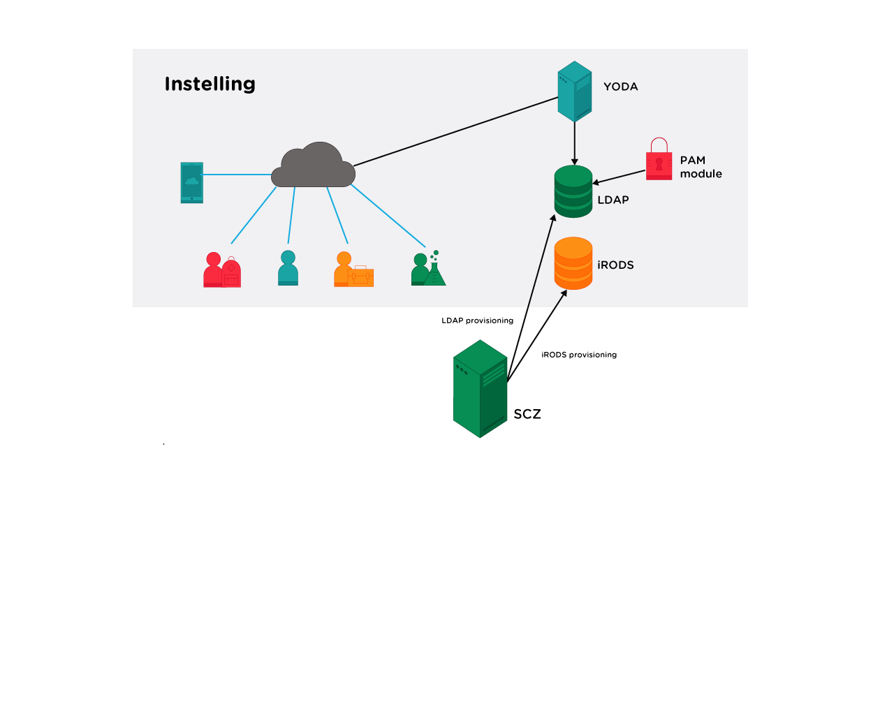

# SCZ iRODS / YODA package

please make ***.env*** file first. You can copy ***env.template*** for that.

~~~
cp env.template .env
~~~

Adjust the contents where appropriate

## Adjust your existing Apache Config

Add following lines to your VirtualHost config

~~~
    ProxyPass /ldap         http://127.0.0.1:8181/phpldapadmin/
    ProxyPassReverse /ldap  http://127.0.0.1:8181/phpldapadmin/

    ProxyPass /api          http://127.0.0.1:8282/api
    ProxyPassReverse /api   http://127.0.0.1:8282/api
~~~

## Install Docker & Docker compose

~~~
yum install docker
yum install docker-compose
~~~

## Start Docker

Start the docker containers

~~~
docker-compose up -d
~~~
